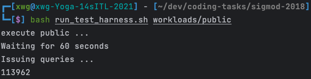

# 6.830

# 1. INTRODUCTION

A few constraints given for the environment were as follows (run on an laptop):

| Processor | i5-11300H  |
| --- | --- |
| Configuration | 4 cores / 8 hyperthreads |
| Main memory | 16 GB RAM |
| OS | Ubuntu 22.04 |
| Dataset | https://db.in.tum.de/sigmod18contest/public.tar.gz |

# 2. OVERALL ARCHITECTURE FOR OPTIMIZATIONS

- join multithreading
    - probe HT
    - merge temp result
- single-threaded policy selection
- zone map sum
- predicate ordering
- simd sum
- self join multithreading
- other

# 3. SPECIFIC OPTIMIZATIONS AND THEIR EFFECTIVENESS

## 3.1 JION multithreaded

A large bottleneck in the base code came from doing joins between two different tables. As a result, I spent a large majority of our time trying to optimize our join algorithm.

In the base code, the join is implemented in Join::run() using a rather simple, serial algorithm. First, a hash table is built on the smaller table, and then the larger table is scanned, probing the hash table during the second scan.

One of the first optimizations,i made here was to use the std::thread interface to parallelize the probing of the hash table. Unfortunately, this added one small problem; in the serial version, all of the values of the join were being put into a single tmp results variable, but in order to avoid race conditions, I needed each thread to have its own version of the `temp_results_thread` variable. In order to do this, I gave each thread one array of temporary results in a larger array of all the temporary results (called `all_tmp_results` ). Then, after each thread finished with its own temp results, we merge all of those results into the main tmp results variable. This final step is necessary, because later operators (higher up the query plan), require that the results are contiguous in memory (so they need to be merged eventually).

```cpp
// New multi-threaded probe phase
const auto hardware_threads = std::thread::hardware_concurrency();
std::vector<std::thread> threads(hardware_threads);
std::vector<std::vector<std::vector<uint64_t>>> all_tmp_results(hardware_threads);
const auto chunk_size = right_->result_size() / hardware_threads;
```

In order to distribute `right_->result_size()` equally among all threads (`hardware_threads`), `chunk_size` has been calculated, which represents the approximate amount of work (number of rows) processed by each thread. However, if `right_->result_size()`is not divisible by hardware_threads, there will be a subset of rows that are not assigned to any thread.
To solve this problem, I set the termination condition (`end`) of the last thread to `right_->result_size()`, so that the last thread will process all remaining lines:

```cpp
for (uint64_t i = 0; i < hardware_threads; ++i) {
    all_tmp_results[i].resize(copy_left_data_.size() + copy_right_data_.size());
    uint64_t start = i * chunk_size;
    uint64_t end = (i+1) == hardware_threads ? right_->result_size() : (i+1) * chunk_size;
    threads[i] = std::thread([this, start, end, &all_tmp_results, &right_key_column, i]() {
        probePhaseParallel(start, end, all_tmp_results[i], right_key_column);
    });
}
```

In the above code, we define the start and end variables to represent the scope (number of rows) processed by each thread. For all threads except the last thread, their processing scope is`[i * chunk_size, (i + 1) * chunk_size)]`. For the last thread (i.e. i + 1 == hardware_threads), its processing scope is `[i * chunk_size, right_ - > result_size ()]`, which guarantees that all lines are processed.

When trying to parallelize the `Join :: run ()` and `Join :: copy2Result` functions, the following points should be noted that data races may occur, which need to be solved by locking or other means:

- `tmp_results_`: In `Join :: cop2ResultParallel`, we let each thread have its own container for temporarily storing results, rather than all threads writing to `tmp_results_`. This avoids data races that occur when writing data to tmp_results_. Nonetheless, subsequent `mergeResults` functions modify tmp_results_, so make sure that all threads have finished writing temporary results and start executing the `mergeResults` function before you start modifying `tmp_results_`.
- `copy_left_data_ and copy_right_data_`: These two should be containers containing input data. Usually, read-only data does not need to be locked because no thread will modify the data. They only need to be locked if there is a thread trying to modify the data in your application and another thread is reading the data.
- `result_size_`: In Join :: copy2ResultParallel, we do not update the `result_size_`, but result_size_ update after all threads have ended and all temporary results have been merged. If you update result_size_ in `Join :: copy2ResultParallel`, I must use mutual exclusion or atomic operations to ensure that no two threads modify result_size_ at the same time.
- `hash_table_`: Reading `hash_table_` can be considered thread-safe while remaining unchanged (i.e. all elements have been inserted and no more elements need to be inserted or deleted). However, if the hash_table_ will be modified, then you need to lock it to prevent data races.

```cpp
// Join threads and merge results
        for (uint64_t thread_index = 0; thread_index < threads.size(); ++thread_index) {
            threads[thread_index].join();
            mergeResults(all_tmp_results[thread_index]);
        }

//        ThreadPool pool(hardware_threads);
//        for (int i = 0; i < hardware_threads; ++i) {
//            pool.enqueue([i, this, &all_tmp_results] {
//                mergeResults(all_tmp_results[i]);
//            });
//        }
```

At first, I used the thread pool to perform mergeResults operations after completing the probe, which would introduce a locking mechanism inside mergeResults, which has a certain overhead. The test result using public dataset is 47950 ms; but I use another strategy, after a single thread completes the probe directly merge it `temp_results_thread` to `tmp_results_` without locking, the test result using public dataset is 46195 ms, there is a gap of about 1000 ms, so the second strategy is retained at the end, and the efficiency of the thread pool may be more obvious in the larger test dataset.




Improved 2.6 times after multi-threaded join optimization operations.

## 3.2 single-threaded policy selection

Upon doing both optimizations (of the probing and the merging of the temporary results), I notice that some of our test cases (particularly the smaller ones), got much slower. I hypothesized that this was due to the overhead of starting threads when the work is small (like when joining two small tables). To fix this, I simply run the serial version of our code when the size of the tables is under a certain threshold,  Doing this allowed us to recover some of our speed on the small test case, but it did not give us a huge improvement on the public test.

## 3.3 zone map sum

Add several private member variables in class `Relation` to construct the zone map

```cpp
class Relation {
private:
    /// Owns memory (false if it was mmaped)
    bool owns_memory_;
    /// The number of tuples
    uint64_t size_;
    /// The join column containing the keys
    std::vector<uint64_t *> columns_;
    /// The zone map sum
    std::vector<uint64_t> zone_map_sum_;
    /// The zone map max
    std::vector<uint64_t> zone_map_max_;
    /// The zone map min
    std::vector<uint64_t> zone_map_min_;
```

Fill each column of the zone map variable in the `Relation :: load Relation` function

```cpp
// Assuming columns() returns a vector-like data structure
    for (int j = 0; j < numColumns; ++j) {
        // zone map sum
        auto sum = 0;
        // zone map max
        auto max = 0;
        // zone map min
        auto min = INT64_MAX;

        for (int i = 0; i < size; ++i) {
            sum += this->columns_[j][i];
            if (this->columns_[j][i] > max) {
                max = this->columns_[j][i];
            }
            if (this->columns_[j][i] < min) {
                min = this->columns_[j][i];
            }
        }
        this->zone_map_sum_.emplace_back(sum);
        this->zone_map_max_.emplace_back(max);
        this->zone_map_min_.emplace_back(min);
    }
```

Fill `select_to_result_col_id_sum_` map in `Scan :: require`, and finally check sum can directly find the value of sum according to `SelectInfo` without going to the result set to calculate once.

In database systems, Zone Map is a storage engine-level optimization technique that maintains some statistics such as maximum, minimum, quantity or sum for each data block (or data area). Let's discuss the advantages of using sum in Zone Map:
Aggregate query optimization: For queries that need to return the sum of a column, if this sum can be obtained directly from the Zone Map, then we can avoid scanning the entire data block, especially when the data block is very large, which can greatly improve performance.
Reduced I/O operations: Since Zone Maps are usually stored in memory, calculating sums through Zone Maps can reduce I/O operations that read data from disk.
Improve data readability: If the business logic related to the sum of data in a region is complex, the sum can be easily obtained through the Zone Map without recalculation.
In general, using sum in Zone Map can mainly provide performance optimization for SUM-type aggregated queries and queries that require the use of sum information. It improves query efficiency by reducing unnecessary data scanning.

## 3.4 predicate ordering

Predicate sorting plays an important role in database query optimization, and it can have a significant impact on query performance. In the code, the implementation of this sorting uses C++ std :: sort function. The principle is as follows:
Predicate ordering optimizes a query based on an algorithm that orders different parts of the query (usually joins) in a certain order. For join operations, the purpose of sorting predicates is usually to minimize the amount of data processed in join operations.
In the code, the predicate is first copied into the `predicates_copy` variable and then sorted by the `size` of the connection correlation. This is done by comparing the size of the left and right relationships. If the product of the left and right relationships is less than the product of the other pair of left and right relationships, then we consider the former to be less than the latter.
After the sorting operation is completed, the join operation can be performed in the sorted order. This ensures that the connection operation processed first handles less data than the post-processing operation, thereby improving the query speed

```cpp
std::sort(predicates_copy.begin(), predicates_copy.end(), [this](const PredicateInfo& lhs, const PredicateInfo& rhs) {
        auto firstL = getRelation(lhs.left.rel_id).size();
        auto firstR = getRelation(lhs.right.rel_id).size();
        auto secondL = getRelation(rhs.left.rel_id).size();
        auto secondR = getRelation(rhs.right.rel_id).size();
        auto firstSize = firstR*firstL;
        auto secondSize = secondL*secondR;
        return firstSize < secondSize;
    });
```

## 3.5 simd sum

```cpp
uint64_t sum = 0;
auto col_id = input_->resolve(sInfo);
auto result_col = results[col_id];
#pragma omp simd
for (auto iter = result_col; iter < (result_col + result_size_); ++iter) {
     sum += *iter;
}
check_sums_.emplace_back(sum);
```

`#pragma omp simd` is used to speed up traversal and summation operations in result_col arrays. Since this summation operation is the same on every element in the array, it is ideal to use SIMD parallelization to improve performance.

## 3.6other


`push_back` and `emplace_back` are two ways to add new elements to C++ STL containers such as std :: vector, std :: list, std :: deque, etc. The main difference between them is the way they handle data and objects.
push_back function adds an element to the end of the container. This new element is created in main memory and then copied or moved into the container.
On the other hand, emplace_back construct a new element and create it directly at the end of the container, avoiding the overhead of copy or move operations. This is achieved by constructing the object directly at the memory location using the provided parameters.

# 4. Optimizations that didn’t work

## 4.1 self join multithreading

```cpp
for (uint64_t i = 0; i < num_threads; ++i) {
    uint64_t start = i * step + std::min(i, excess);
    uint64_t end = start + step + (i < excess);
     // partition the range [start, end)
    auto part_left_col = left_col + start;
    auto part_right_col = right_col + start;
    threads[i] = std::thread(&SelfJoin::compareColumnsAndCopyRange, this, part_left_col, part_right_col, end- start, start);
}
```

I employed the parallelization strategy from Self Join; that is, I partitioned the input, had each thread handle its partition separately, and then merged the results into the final results in parallel. Doing this gave us about a -4.4% performance degradation.

May be caused by too small dataset size and locking overhead.

## 4.2 Zone Map { min, max }

Some situations encountered in optimization: there are also maximum and minimum values in zonemap. At first, it was planned to be used in FilterScan to filter predicate conditions that exceed the range, but after adding it, it did not improve but also reduced the speed because of more judgments. It may be a case where there is no such condition in the dataset.

# 5. Results

## 5.1 public dataset

- basic https://github.com/loloxwg/coding-tasks/commit/be58dc199e119ab1c8e1668a8946ab14a4921ead


- in the end  https://github.com/loloxwg/coding-tasks/commit/1fd0d8f6dbe309b39a6b8d8c42e740f5bc3a3d44


## 5.2 small dataset

- basic https://github.com/loloxwg/coding-tasks/commit/be58dc199e119ab1c8e1668a8946ab14a4921ead


- in the end https://github.com/loloxwg/coding-tasks/commit/1fd0d8f6dbe309b39a6b8d8c42e740f5bc3a3d44


# References

[Database programming competition](https://bentonw.com/post/2021-05-01-database-comp/)

[ACM SIGMOD 2018 Programming Contest](https://db.in.tum.de/sigmod18contest/task.shtml)

[](https://github.com/tabac/sigmod-contest-2018/blob/master/README.md)